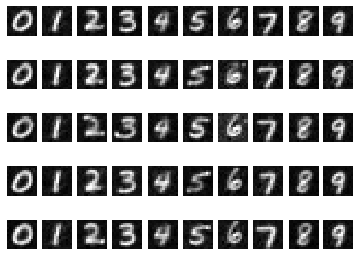

## Overview

This repository contains an implementation of a diffusion model for generating MNIST images. Diffusion models have gained popularity for their ability to generate high-quality images through a process of iterative refinement. This project demonstrates how such a model can be applied to the MNIST dataset for generating handwritten digits.

## About This Implementation

## Requirements

- Python 3.x
- PyTorch
- NumPy
- Matplotlib

## Results

Results on MNIST dataset, generating 50 images, 5 from each digit:

